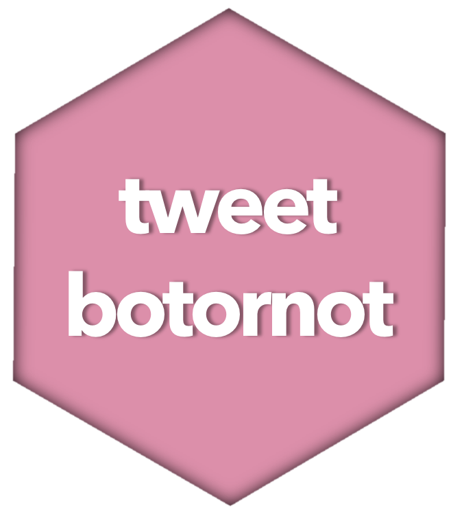

# tweetbotornot 

[](https://www.tidyverse.org/lifecycle/#experimental)
[](https://travis-ci.org/mkearney/tweetbotornot)
[](https://codecov.io/github/mkearney/tweetbotornot?branch=master)

An R package for classifying Twitter accounts as `bot or not`.

## Features

Uses machine learning to classify Twitter accounts as bots or not bots.
The **default model** is 93.53% accurate when classifying bots and
95.32% accurate when classifying non-bots. The **fast model** is 91.78%
accurate when classifying bots and 92.61% accurate when classifying
non-bots.

Overall, the **default model** is correct 93.8% of the time.

Overall, the **fast model** is correct 91.9% of the time.

## Install

Install from CRAN:

``` r
## install from CRAN
install.packages("tweetbotornot")
```

Install the development version from Github:

``` r
## install remotes if not already
if (!requireNamespace("remotes", quietly = TRUE)) {
  install.packages("remotes")
}

## install tweetbotornot from github
devtools::install_github("mkearney/tweetbotornot")
```

## API authorization

Users must be authorized in order to interact with Twitter’s API. To
setup your machine to make authorized requests, you’ll either need to be
signed into Twitter and working in an interactive session of R–the
browser will open asking you to authorize the rtweet client
(rstats2twitter)–or you’ll need to create an app (and have a developer
account) and your own API token. The latter has the benefit of (a)
having sufficient permissions for write-acess and DM (direct messages)
read-access levels and (b) more stability if Twitter decides to shut
down \[@kearneymw\](<https://twitter.com/kearneymw>)’s access to Twitter
(I try to be very responsible these days, but Twitter isn’t always
friendly to academic use cases). To create an app and your own Twitter
token, [see these instructions provided in the rtweet
package](http://rtweet.info/articles/auth.html).

## Usage

There’s one function `tweetbotornot()` (technically there’s also
`botornot()`, but it does the same exact thing). Give it a vector of
screen names or user IDs and let it go to work.

``` r
## load package
library(tweetbotornot)

## select users
users <- c("realdonaldtrump", "netflix_bot",
  "kearneymw", "dataandme", "hadleywickham",
  "ma_salmon", "juliasilge", "tidyversetweets", 
  "American__Voter", "mothgenerator", "hrbrmstr")

## get botornot estimates
data <- tweetbotornot(users)

## arrange by prob ests
data[order(data$prob_bot), ]
#> # A tibble: 11 x 3
#>    screen_name     user_id            prob_bot
#>    <chr>           <chr>                 <dbl>
#>  1 hadleywickham   69133574            0.00754
#>  2 realDonaldTrump 25073877            0.00995
#>  3 kearneymw       2973406683          0.0607 
#>  4 ma_salmon       2865404679          0.150  
#>  5 juliasilge      13074042            0.162  
#>  6 dataandme       3230388598          0.227  
#>  7 hrbrmstr        5685812             0.320  
#>  8 netflix_bot     1203840834          0.978  
#>  9 tidyversetweets 935569091678691328  0.997  
#> 10 mothgenerator   3277928935          0.998  
#> 11 American__Voter 829792389925597184  1.000  
```

### Integration with rtweet

The `botornot()` function also accepts data returned by
[rtweet](http://rtweet.info) functions.

``` r
## get most recent 100 tweets from each user
tmls <- get_timelines(users, n = 100)

## pass the returned data to botornot()
data <- botornot(tmls)

## arrange by prob ests
data[order(data$prob_bot), ]
#> # A tibble: 11 x 3
#>    screen_name     user_id            prob_bot
#>    <chr>           <chr>                 <dbl>
#>  1 hadleywickham   69133574            0.00754
#>  2 realDonaldTrump 25073877            0.00995
#>  3 kearneymw       2973406683          0.0607 
#>  4 ma_salmon       2865404679          0.150  
#>  5 juliasilge      13074042            0.162  
#>  6 dataandme       3230388598          0.227  
#>  7 hrbrmstr        5685812             0.320  
#>  8 netflix_bot     1203840834          0.978  
#>  9 tidyversetweets 935569091678691328  0.997  
#> 10 mothgenerator   3277928935          0.998  
#> 11 American__Voter 829792389925597184  1.000  
```

### `fast = TRUE`

The default \[gradient boosted\] model uses both users-level (bio,
location, number of followers and friends, etc.) **and** tweets-level
(number of hashtags, mentions, capital letters, etc. in a user’s most
recent 100 tweets) data to estimate the probability that users are bots.
For larger data sets, this method can be quite slow. Due to Twitter’s
REST API rate limits, users are limited to only 180 estimates per every
15 minutes.

To maximize the number of estimates per 15 minutes (at the cost of being
less accurate), use the `fast = TRUE` argument. This method uses
**only** users-level data, which increases the maximum number of
estimates per 15 minutes to *90,000*\! Due to losses in accuracy, this
method should be used with caution\!

``` r
## get botornot estimates
data <- botornot(users, fast = TRUE)

## arrange by prob ests
data[order(data$prob_bot), ]
#> # A tibble: 11 x 3
#>    screen_name     user_id            prob_bot
#>    <chr>           <chr>                 <dbl>
#>  1 hadleywickham   69133574            0.00185
#>  2 kearneymw       2973406683          0.0415 
#>  3 ma_salmon       2865404679          0.0661 
#>  4 dataandme       3230388598          0.0965 
#>  5 juliasilge      13074042            0.112  
#>  6 hrbrmstr        5685812             0.121  
#>  7 realDonaldTrump 25073877            0.368  
#>  8 netflix_bot     1203840834          0.978  
#>  9 tidyversetweets 935569091678691328  0.998  
#> 10 mothgenerator   3277928935          0.999  
#> 11 American__Voter 829792389925597184  0.999  
```

## NOTE

In order to avoid confusion, the package was renamed from “botrnot” to
“tweetbotornot” in June 2018. This package should not be confused with
the [botornot application](http://botornot.co/).
